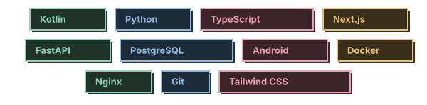
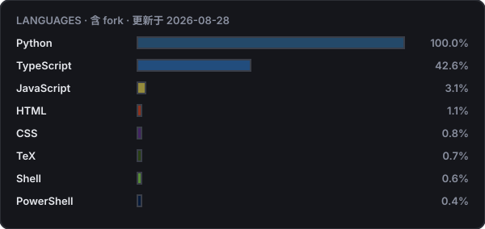

<!-- SAM-DANCING · GitHub Profile · 8-bit 像素治愈风 · 左右两列布局 -->
<!-- 统一使用 dark 主题 SVG：GitHub 的 picture 主题切换对部分组件失效/缓存滞后，导致深浅混用不协调，故统一固定 dark 版本 -->

  

<table>
<tr>
<td width="32%" valign="top">

<b>独立开发者 · AI Agent Builder · Android Rider</b>  
风雨吹我两三年，归来仍是顺风局。

  

  

<b>FIND ME · 联系</b>
 

</td>
<td width="68%" valign="top">

<b>STACK · 技术栈</b>
 

  

<b>LANGUAGES · 语言分布</b> 含 fork · 每日自动刷新
 

</td>
</tr>
</table>

  

  © 2024-2026 Sam-Dancing™ · All Rights Reserved · Lead Developer: Sam-Dancing

