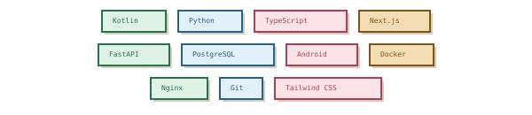
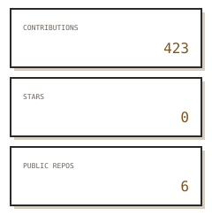
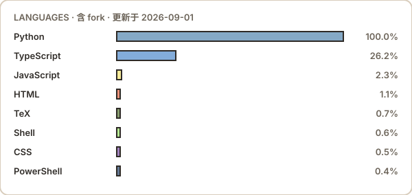

<!-- SAM-DANCING · GitHub Profile · 8-bit 像素治愈风 -->
<!-- 深浅双主题：SVG 均为 -light/-dark 两份，由 prefers-color-scheme 自动切换 -->

  <picture>
    <source media="(prefers-color-scheme: dark)" srcset="assets/banner-hero-dark.svg">
    
  </picture>

  <strong>独立开发者 · AI Agent Builder · Android Rider</strong> 
  风雨吹我两三年，归来仍是顺风局。  
  <a href="https://sam-dancing.work">sam-dancing.work</a>

  <picture>
    <source media="(prefers-color-scheme: dark)" srcset="assets/divider-pixel-dark.svg">
    
  </picture>

## ⌗ STACK · 技术栈

  <picture>
    <source media="(prefers-color-scheme: dark)" srcset="assets/badges-tech-dark.svg">
    
  </picture>

  <picture>
    <source media="(prefers-color-scheme: dark)" srcset="assets/divider-pixel-dark.svg">
    
  </picture>

## ⌗ STATS · GitHub 数据

  <picture>
    <source media="(prefers-color-scheme: dark)" srcset="assets/stats/numbers-dark.svg">
    
  </picture>

  <picture>
    <source media="(prefers-color-scheme: dark)" srcset="assets/stats/heatmap-dark.svg">
    
  </picture>

  <picture>
    <source media="(prefers-color-scheme: dark)" srcset="assets/stats/langs-dark.svg">
    
  </picture>

  数据由 GitHub Actions 每日自动刷新 · 语言分布含 fork 仓库（如实统计）

  <picture>
    <source media="(prefers-color-scheme: dark)" srcset="assets/divider-pixel-dark.svg">
    
  </picture>

## ⌗ BLOG · 博客

  <a href="https://sam-dancing.work">
    <picture>
      <source media="(prefers-color-scheme: dark)" srcset="assets/blog-banner-dark.svg">
      
    </picture>
  </a>

  <picture>
    <source media="(prefers-color-scheme: dark)" srcset="assets/divider-pixel-dark.svg">
    
  </picture>

## ⌗ CONTACT · 联系

  <a href="https://github.com/Sam-dancing-nu1">GITHUB</a> ·
  <a href="https://space.bilibili.com/1373240281">BILIBILI</a> ·
  <a href="mailto:sam-dancing@qq.com">EMAIL</a>

  <picture>
    <source media="(prefers-color-scheme: dark)" srcset="assets/avatar-pixel-dark.svg">
    
  </picture>

  © 2024-2026 Sam-Dancing™ · All Rights Reserved · Lead Developer: Sam-Dancing

